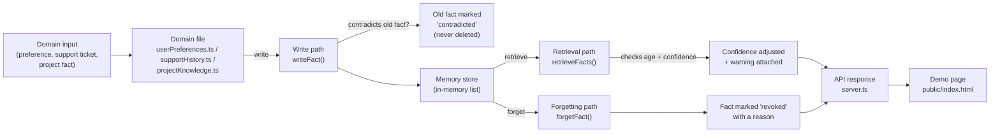

# Architecture

## Flow: 3 paths through one shared engine

## What each path does

**Write path.** A domain hands the engine a new fact: its content, source, confidence, and scope. If this fact replaces an older one (e.g. "lives in Riffa" replacing "lives in Manama"), the caller passes the old fact's ID, and the engine marks that old fact `contradicted` — it is never deleted, only relabeled. This matters because a system that silently overwrites its own memory can't explain itself later.

**Retrieval path.** When something asks "what do we know about this scope?", the engine only returns `active` facts, but it doesn't hand them back at face value. Each fact's age is checked: if it hasn't been reconfirmed in over 90 days, its confidence is reduced and a warning is attached ("this might be outdated"). If a fact was always low-confidence, it gets a different warning ("I'm not very confident about this"). This is the literal mechanism behind the "I might be wrong" requirement in the brief.

**Forgetting path.** A fact can be explicitly revoked — by user request, or because it's confirmed wrong — with a reason recorded. A revoked fact stops appearing in normal retrieval, but (like a contradicted fact) it isn't erased: the memory inspector can still show it, along with why it was forgotten.

**Domain files.** Each domain (`userPreferences.ts`, `supportHistory.ts`, `projectKnowledge.ts`) has exactly one job: turn a real-world input into the engine's shared shape, tagged with a scope like `user:<id>` or `project:<id>`. None of them contain any decision logic about confidence or staleness — that lives in exactly one place, the engine.

**API + demo page.** `server.ts` exposes each domain as endpoints, plus a `/api/forget` endpoint and a `/api/inspect/:scope` endpoint (the memory inspector). `public/index.html` is a thin client that calls these endpoints and displays the result, including the confidence bar and any warning.

## Why this shape

Adding a fourth domain (say, "meeting notes") means writing one new file that produces the same shape of fact — zero changes to `memoryStore.ts`. The staleness rule, the contradiction handling, and the forgetting mechanism are all reused automatically. The three paths (write, retrieve, forget) are also exactly what the brief scores under "technical depth": this is real storage and retrieval logic with an actual forgetting policy, not a vector database pretending to have one.